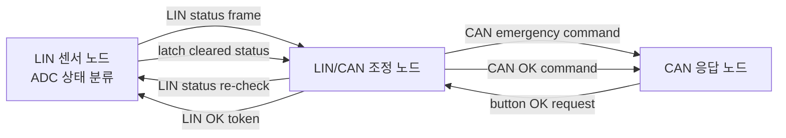
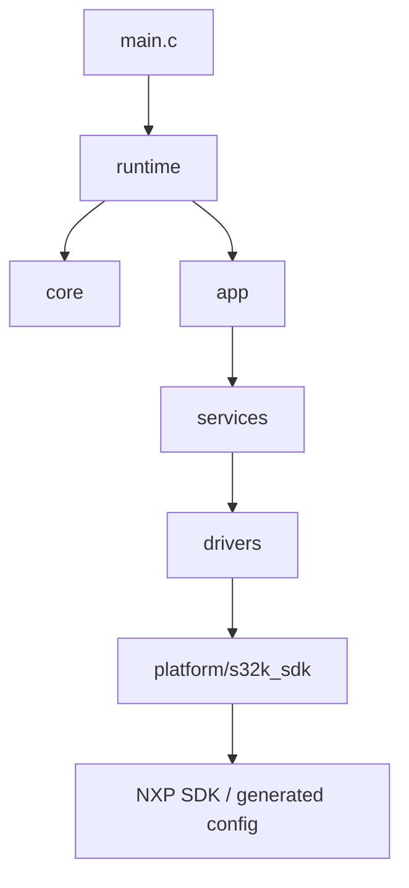

# S32K LIN/CAN RTOS Communication Demo

S32K144 보드 3대를 역할별로 나누어 구성한 LIN/CAN 통신 프로젝트입니다. LIN 센서 노드는 ADC 입력을 상태로 분류하고, LIN/CAN 조정 노드는 센서 상태를 확인한 뒤 CAN 응답 노드에 emergency 또는 OK 명령을 전달합니다. CAN 응답 노드의 버튼 입력은 복구 요청일 뿐이며, 최종 복구 승인은 조정 노드가 LIN 센서 상태를 다시 확인한 뒤 결정합니다.

같은 통신 정책을 두 가지 실행 구조로 정리했습니다.

| 구분 | 경로 | 목적 |
|---|---|---|
| Cooperative version | `s32k_cooperative/` | RTOS 없이 직접 구현한 주기 dispatcher 기반 구조 |
| FreeRTOS version | `s32k_rtos/` | 동일한 정책을 FreeRTOS task ownership 기준으로 재구성한 구조 |

---

## Demo media
putty 영상 추가 예정


https://github.com/user-attachments/assets/0bafa2e0-7b3a-42e6-be9b-d4daa138f2f6


---

## What this project demonstrates

이 프로젝트의 핵심은 단순한 LIN/CAN 송수신이 아니라, **센서 상태 확인을 기반으로 복구 승인을 제어하는 다중 노드 통신 흐름**입니다.



동작은 크게 세 단계로 나뉩니다.

| 단계 | 트리거 | 조정 노드의 판단 | 결과 |
|---|---|---|---|
| 1. Sensor monitoring | LIN 센서 노드가 ADC 값을 읽음 | ADC 상태를 `SAFE`, `WARNING`, `DANGER`, `EMERGENCY`로 분류 | `EMERGENCY` 감지 시 sensor latch 설정 |
| 2. Emergency propagation | 조정 노드가 LIN status를 주기적으로 확인 | emergency 또는 fault 상태인지 판단 | CAN 응답 노드에 emergency command 전송 |
| 3. Recovery arbitration | CAN 응답 노드가 OK request 전송 | LIN 센서 상태를 다시 확인한 뒤 복구 가능 여부 판단 | 조건 만족 시 LIN OK token 전송 후 CAN OK command 전송 |

CAN 응답 노드의 버튼 입력은 직접 복구 명령이 아니라 복구 요청입니다.  
최종 복구 여부는 조정 노드가 LIN 센서 상태를 다시 확인한 뒤 결정합니다.

| 센서 상태 | 조정 노드 동작 |
|---|---|
| 여전히 `EMERGENCY` 구간 | 복구 승인 보류 |
| emergency 구간은 벗어났지만 latch 유지 중 | LIN OK token 전송 |
| latch 해제 확인 | CAN OK command 전송 |

---

## Node roles

| 노드 | 경로 | 역할 |
|---|---|---|
| LIN/CAN 조정 노드 | `S32K_LinCanBle_master` / `RTOS_S32K_LinCanBle_master` | LIN 센서 상태 확인, CAN emergency/OK 명령 전달, UART 상태 출력 |
| LIN 센서 노드 | `S32K_Lin_slave` / `RTOS_S32K_Lin_slave` | ADC 상태 분류, emergency latch 유지, LIN status 응답 |
| CAN 응답 노드 | `S32K_Can_slave` / `RTOS_S32K_Can_slave` | CAN 명령 수신, LED 상태 표시, 버튼 기반 OK request 전송 |

일부 소스 내부 이름은 `slave1`, `slave2` 형태입니다. 공개 문서에서는 역할이 바로 드러나도록 다음 이름을 사용합니다.

| 내부 이름 | 공개 문서 역할명 | 의미 |
|---|---|---|
| `slave1` | CAN 응답 노드 | CAN 명령을 받고 LED/button 동작으로 응답하는 노드 |
| `slave2` | LIN 센서 노드 | ADC 상태를 분류하고 LIN status frame으로 응답하는 센서 노드 |

`LinCanBle`는 기존 작업명에서 이어진 이름입니다. 이 저장소는 BLE protocol stack 구현이 아니라, 외부 UART peer 또는 BLE 모듈에서 들어오는 명령을 보조 UART 경로로 받아 기존 console command 흐름에 연결하는 구조를 포함합니다.

---

## Repository structure

```text
.
├── README.md
├── docs/
│   ├── architecture_overview.md
│   ├── cooperative_vs_rtos.md
│   ├── hardware_pin_mapping.md
│   └── nodes/
├── s32k_cooperative/
│   ├── S32K_LinCanBle_master/
│   ├── S32K_Lin_slave/
│   └── S32K_Can_slave/
└── s32k_rtos/
    ├── README.md
    ├── RTOS_S32K_LinCanBle_master/
    ├── RTOS_S32K_Lin_slave/
    └── RTOS_S32K_Can_slave/
```

각 노드 디렉터리는 S32DS 프로젝트에 붙여 넣어 확인하기 쉽도록 일부 wrapper와 service 코드를 독립적으로 포함합니다. 실제 제품 구조라면 공통 library로 분리할 수 있지만, 이 저장소에서는 노드별 bring-up과 cooperative/RTOS 비교가 쉽도록 독립 배치했습니다.

---

## Execution models

이 저장소는 같은 LIN/CAN 상태 전파 및 복구 승인 정책을 두 가지 실행 구조로 정리합니다.  
두 버전의 주요 주기 정책은 거의 동일하며, 차이는 주기 자체가 아니라 실행 주체와 ownership에 있습니다.

### Common periodic work

| 노드 | 주기 작업 구성 |
|---|---|
| LIN/CAN 조정 노드 | UART: 1 ms<br>LIN fast: 1 ms<br>CAN: 10 ms<br>LIN poll: 20 ms<br>render: 100 ms<br>heartbeat: 1000 ms |
| LIN 센서 노드 | LIN fast: 1 ms<br>ADC: 20 ms<br>LED: 100 ms<br>heartbeat: 1000 ms |
| CAN 응답 노드 | button: 10 ms<br>CAN: 10 ms<br>LED: 100 ms<br>heartbeat: 1000 ms |

### Cooperative version

Cooperative 버전은 RTOS 없이 `RuntimeTask_RunDue()` 기반의 주기 실행 구조를 사용합니다.  
`main.c`는 `Runtime_Init()`으로 보드와 모듈을 초기화한 뒤 `Runtime_Run()`에 진입하고, runtime 계층은 등록된 주기 작업을 due time 기준으로 순차 호출합니다.

### FreeRTOS version

FreeRTOS 버전은 동일한 주기 작업을 FreeRTOS task 단위로 분리한 구조입니다.  
각 task는 `vTaskDelayUntil()` 기반으로 주기를 유지하며, UART/CAN/LIN/render/heartbeat 같은 작업의 실행 ownership을 task 단위로 나눕니다.

FreeRTOS 전환의 목적은 기능을 새로 추가하는 것이 아니라, 같은 통신 정책을 RTOS task ownership 기준으로 재구성하는 것입니다.

---

## Software architecture

세 노드는 유사한 계층 구조를 사용합니다.



| 계층 | 경로 | 책임 |
|---|---|---|
| Entry | `main.c` | runtime 초기화 후 실행 진입 |
| Runtime | `runtime/` | board init, task 구성, 실행 루프 또는 FreeRTOS task 생성 |
| Core | `core/` | tick, task helper, queue, 공통 상태 타입 |
| Application | `app/` | 노드별 정책, 상태 판단, console/render 처리 |
| Service | `services/` | CAN/LIN/ADC/UART 상태기계와 protocol 처리 |
| Driver adapter | `drivers/` | 보드 I/O, CAN/LIN/UART/ADC/tick 추상화 |
| SDK binding | `platform/s32k_sdk/` | NXP SDK와 상위 코드 사이의 wrapper |

상위 application/service 계층이 `FLEXCAN_DRV_*`, `LIN_DRV_*`, `ADC_DRV_*`, `PINS_DRV_*` 같은 NXP SDK API에 직접 묶이지 않도록 wrapper 계층을 두었습니다.

---

## Build scope

이 저장소는 하드웨어 실험에 사용한 application/service/driver/runtime 계층 소스와 관련 문서를 정리한 저장소입니다. `git clone`만으로 바로 빌드되는 S32DS 프로젝트 전체는 포함하지 않습니다.

실제 보드 빌드에는 다음 항목이 필요합니다.

- S32 Design Studio 프로젝트 설정
- NXP S32K SDK 또는 RTD 패키지
- 생성된 pin/peripheral configuration 파일
- linker script
- startup/system 파일
- FreeRTOS 설정 파일
- 실제 보드별 CAN/LIN transceiver 연결

---

## Limitations

이 저장소는 S32K 보드 기반 통신 구조와 실행 구조 전환을 보여주기 위한 프로젝트입니다.

- 양산 ECU 구현이 아닙니다.
- AUTOSAR Classic stack 구현이 아닙니다.
- ISO 26262 안전 소프트웨어가 아닙니다.
- 실제 actuator 제어는 포함하지 않습니다.
- LED, button, ADC, UART console을 이용해 통신 정책과 상태 흐름을 검증한 범위입니다.

---

## Documentation

| 문서 | 내용 |
|---|---|
| `docs/architecture_overview.md` | 전체 구조, 통신 흐름, 계층 구조 |
| `docs/cooperative_vs_rtos.md` | Cooperative 구조와 FreeRTOS 구조 비교 |
| `docs/hardware_pin_mapping.md` | 노드별 핀 설정과 주변장치 매핑 |
| `docs/nodes/S32K_LinCanBle_master.md` | LIN/CAN 조정 노드 설명 |
| `docs/nodes/S32K_Lin_slave.md` | LIN 센서 노드 설명 |
| `docs/nodes/S32K_Can_slave.md` | CAN 응답 노드 설명 |
