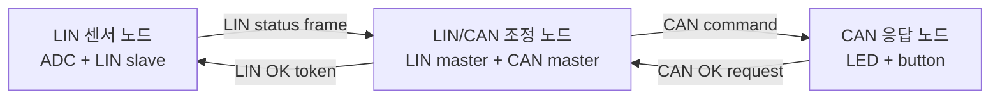
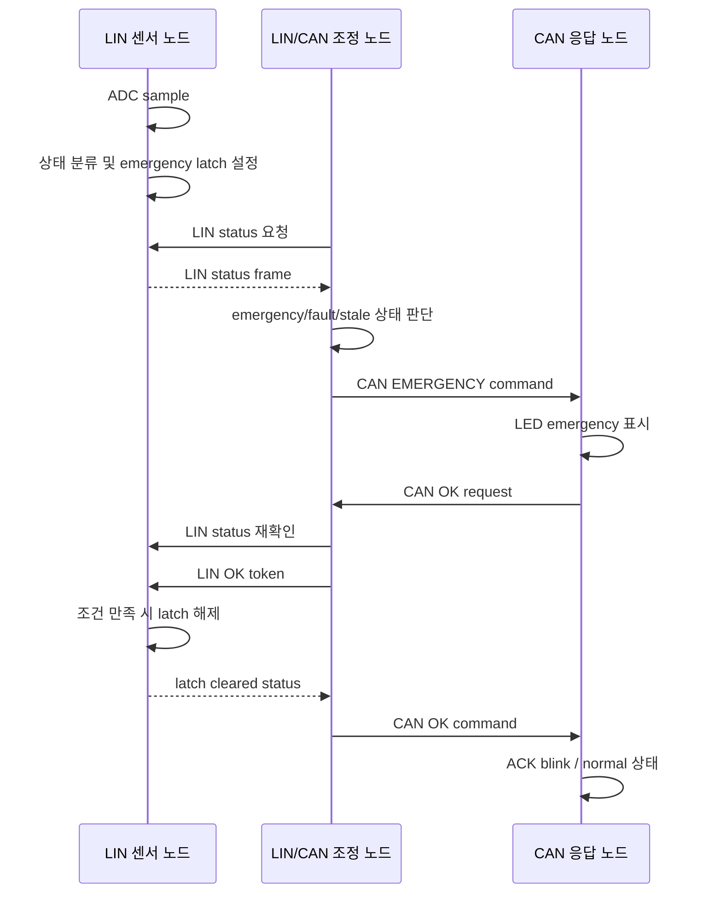
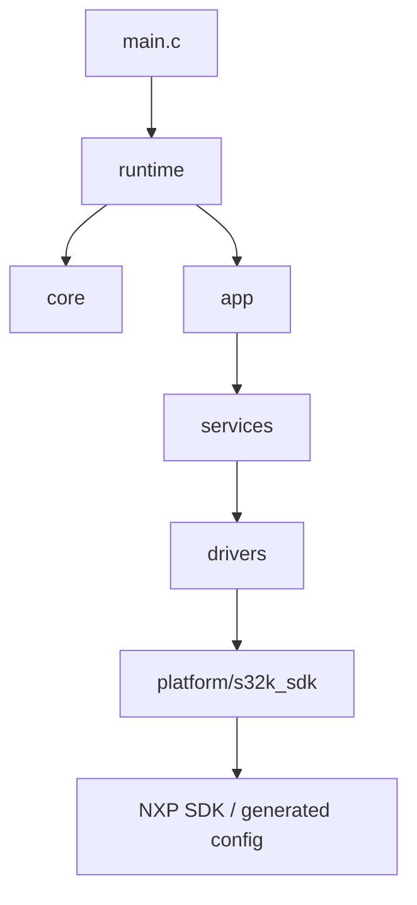
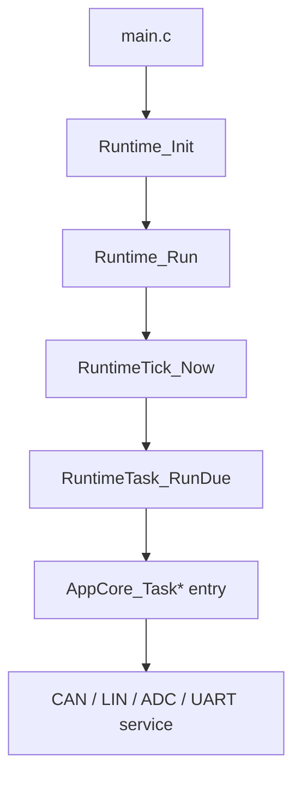
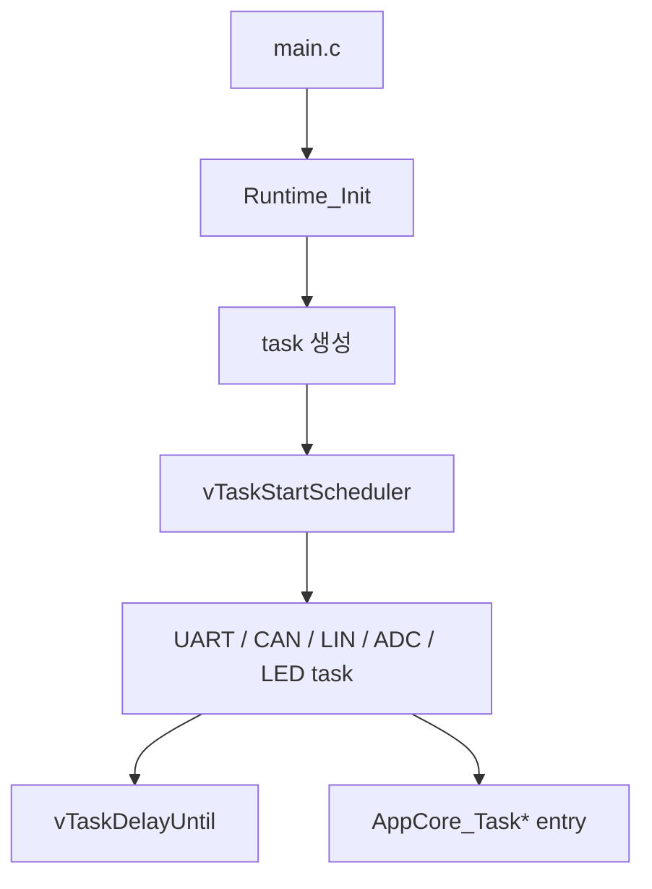

# 아키텍처 개요

이 문서는 S32K 다중 노드 LIN/CAN 통신 데모의 전체 구조를 설명합니다. 같은 통신 시나리오를 `s32k_cooperative/`의 cooperative 실행 구조와 `s32k_rtos/`의 FreeRTOS 실행 구조로 나누어 정리했습니다.

---

## 1. 전체 구조

시스템은 세 개의 펌웨어 역할로 구성됩니다.

| 노드 | 역할 | 요약 |
|---|---|---|
| `S32K_LinCanBle_master` | LIN/CAN 조정 노드 | LIN 센서 노드의 상태를 확인하고 CAN 응답 노드에 emergency/OK 명령을 전달합니다. |
| `S32K_Lin_slave` | LIN 센서 노드 | ADC 값을 상태 구간으로 분류하고 emergency latch 상태를 LIN status frame으로 제공합니다. |
| `S32K_Can_slave` | CAN 응답 노드 | CAN 명령에 따라 LED 상태를 바꾸고 버튼 입력을 OK request로 전달합니다. |

---

## 2. 노드별 책임

### 2.1 LIN/CAN 조정 노드

LIN 센서 노드와 CAN 응답 노드 사이에서 상태 확인과 명령 전달을 담당합니다.

- UART console 상태 출력 및 명령 입력 처리
- 외부 UART peer 또는 BLE 모듈 명령 브리지 처리
- LIN 센서 노드 상태 주기 확인
- CAN 응답 노드에 emergency/OK/OFF 등 명령 전달
- OK request 수신 후 센서 상태 재확인
- sensor latch 해제 확인 후 CAN OK 명령 전송

### 2.2 LIN 센서 노드

ADC 입력을 상태로 변환하고, 그 상태를 LIN으로 제공합니다.

- ADC sampling
- `SAFE`, `WARNING`, `DANGER`, `EMERGENCY` 상태 분류
- emergency latch 유지
- LIN status frame 응답
- LIN OK token 수신
- 현재 상태가 emergency가 아닐 때에만 latch 해제
- LED를 통한 센서 상태 표시

### 2.3 CAN 응답 노드

조정 노드의 CAN 명령을 받아 보드에서 확인 가능한 응답을 수행합니다.

- CAN command 수신
- emergency 명령 수신 시 LED emergency 표시
- 로컬 버튼 debounce
- emergency 상태에서 버튼 입력 시 OK request 전송
- CAN OK 명령 수신 후 ACK blink 및 정상 상태 복귀

---

## 3. 통신 흐름

핵심 정책은 CAN 응답 노드의 OK request를 조정 노드가 그대로 통과시키지 않는다는 점입니다. 조정 노드는 최신 LIN 센서 상태를 확인하고, 센서 조건이 회복된 경우에만 복구 명령을 전달합니다.

---

## 4. 계층 구조

세 노드는 공통적으로 아래 계층 구조를 사용합니다.

| 계층 | 주요 책임 |
|---|---|
| `main.c` | runtime 초기화와 실행 진입 |
| `runtime/` | board 초기화, task 구성, 실행 구조 조립 |
| `core/` | tick, task helper, queue, 공통 타입 |
| `app/` | 노드별 정책과 상태 판단 |
| `services/` | CAN/LIN/ADC/UART 상태기계와 protocol 처리 |
| `drivers/` | 하드웨어 접근 adapter |
| `platform/s32k_sdk/` | NXP SDK symbol wrapper |

이 구조의 목적은 상위 정책 코드가 NXP SDK API에 직접 의존하지 않도록 하는 것입니다. application 계층은 센서 상태, 복구 승인, console 출력 같은 정책을 다루고, 하드웨어 세부 호출은 service/driver/platform 계층으로 내려갑니다.

---

## 5. Cooperative 실행 흐름

Cooperative 버전은 직접 구현한 주기 실행 dispatcher를 사용합니다.

각 노드는 자신에게 필요한 task만 runtime table에 등록합니다. 예를 들어 LIN/CAN 조정 노드는 UART, LIN fast, CAN, LIN poll, render, heartbeat task를 사용하고, LIN 센서 노드는 LIN fast, ADC, LED, heartbeat task만 사용합니다.

---

## 6. FreeRTOS 실행 흐름

FreeRTOS 버전은 cooperative 버전의 주기 실행 단위를 FreeRTOS task로 나눈 구조입니다.

기존 application/service/driver 계층은 대부분 유지하고, runtime 계층이 task 생성과 주기 실행을 담당합니다. 따라서 FreeRTOS 버전은 기능 자체를 새로 만든 것이 아니라, 같은 통신 시나리오를 더 명확한 태스크 단위로 분리한 전환 버전입니다.

---

## 7. 설계 의도

이 구조는 통신 정책과 하드웨어 접근을 분리하기 위해 application, service, driver, platform 계층을 나누었습니다. cooperative 버전에서는 전체 실행 흐름을 단순하게 추적할 수 있고, FreeRTOS 버전에서는 같은 기능을 태스크 단위로 분리해 주기 실행, 공유 상태, task ownership 문제를 확인할 수 있습니다.

`LinCanBle` 이름은 기존 작업명에서 이어진 이름입니다. 이 노드는 BLE protocol stack을 직접 구현하지 않고, 외부 모듈 또는 UART peer에서 들어오는 명령을 보조 UART 경로로 받아 console 명령 흐름에 연결합니다.
