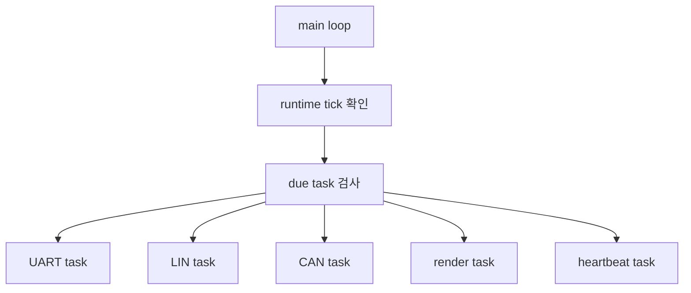
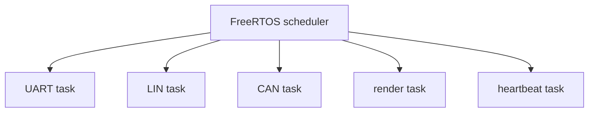

# Cooperative 구조와 FreeRTOS 구조 비교

이 문서는 같은 S32K LIN/CAN 통신 시나리오를 cooperative dispatcher와 FreeRTOS task 구조로 나누어 구현한 차이를 정리합니다.

---

## 1. 비교 목적

두 버전의 차이는 통신 정책이나 protocol 차이가 아닙니다. 차이는 **실행 주체와 ownership을 어디에 두는가**입니다.

| 항목 | Cooperative version | FreeRTOS version |
|---|---|---|
| 실행 주체 | 직접 구현한 runtime dispatcher | FreeRTOS scheduler |
| 주기 실행 | `RuntimeTask_RunDue()` | `vTaskDelayUntil()` |
| 코드 흐름 | 하나의 main loop에서 순차 실행 | task별 entry로 분리 실행 |
| 시간 기준 | runtime tick | FreeRTOS tick 기반 task context |
| 장점 | 흐름이 단순하고 디버깅이 쉬움 | 작업별 책임과 주기를 분리하기 쉬움 |
| 주의점 | 긴 작업이 전체 loop를 지연시킬 수 있음 | 공유 상태와 task ownership 설계가 필요함 |

---

## 2. Cooperative version

Cooperative 버전은 RTOS 없이 정해진 주기마다 task 함수를 직접 호출합니다.

이 구조의 장점은 전체 흐름이 명확하다는 점입니다. 각 task가 짧게 끝난다는 전제에서는 구현과 디버깅이 단순합니다.

주의할 점은 하나의 task가 오래 실행되면 나머지 task의 실행도 늦어진다는 점입니다. 따라서 통신 polling, console 처리, render 처리 같은 작업은 짧고 예측 가능한 형태로 유지해야 합니다.

---

## 3. FreeRTOS version

FreeRTOS 버전은 주기가 다른 작업을 task 단위로 분리합니다.

각 task는 `vTaskDelayUntil()`을 사용해 자신의 주기를 유지합니다. 이 구조에서는 task별 책임이 더 분명해지지만, shared state를 다루는 방식이 중요해집니다.

특히 LIN/CAN 조정 노드에서는 LIN fast 처리와 LIN status polling을 하나의 LIN task ownership 아래에 두어 LIN module 상태가 여러 task에서 동시에 변경되지 않도록 구성했습니다.

---

## 4. Master node task mapping

| 기능 | Cooperative | FreeRTOS |
|---|---|---|
| UART console | 1 ms task | UART task |
| Auxiliary UART bridge | UART task 내부 처리 | UART task 내부 처리 |
| LIN state machine | 1 ms LIN fast task | LIN task |
| LIN status polling | 20 ms LIN poll task | LIN task 내부 주기 분기 |
| CAN processing | 10 ms CAN task | CAN task |
| Console rendering | 100 ms render task | render task |
| Heartbeat | 1000 ms heartbeat task | heartbeat task |

---

## 5. Portfolio interpretation

이 프로젝트에서 FreeRTOS 전환은 “RTOS를 붙였다”는 것만 보여주는 것이 아닙니다. 더 중요한 지점은 다음입니다.

- 기존 정책을 유지한 상태에서 실행 구조만 분리했습니다.
- task별 주기와 책임을 명확히 나누었습니다.
- LIN/CAN/console/render처럼 성격이 다른 작업의 ownership을 분리했습니다.
- polling 기반 구조가 갖는 한계와 RTOS 전환 시 고려해야 할 공유 상태 문제를 드러냅니다.

다만 현재 구조는 완전한 event-driven RTOS 설계는 아닙니다. 주기 task 기반 구조이며, 이후 개선한다면 queue, task notification, event group을 사용해 CAN 수신, LIN 완료, button event 등을 더 명시적인 event 흐름으로 바꿀 수 있습니다.
