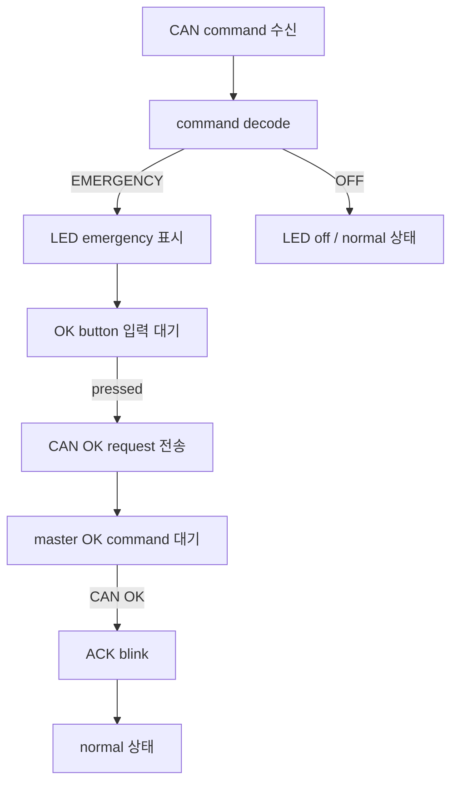

# CAN 응답 노드

`S32K_Can_slave`는 LIN/CAN 조정 노드의 CAN 명령을 받아 LED와 버튼으로 응답 흐름을 확인하는 노드입니다. Cooperative 버전은 `s32k_cooperative/S32K_Can_slave/`에 있고, FreeRTOS 버전은 `s32k_rtos/RTOS_S32K_Can_slave/`에 있습니다.

---

## 1. 역할

이 노드는 CAN command를 수신하고, 보드의 LED와 버튼으로 emergency/OK 흐름을 확인합니다.

주요 책임은 다음과 같습니다.

- CAN command 수신
- emergency command 수신 시 LED emergency 표시
- 로컬 OK button debounce
- emergency 상태에서 버튼 입력 시 CAN OK request 전송
- master의 CAN OK command 수신 후 ACK blink
- OFF command 수신 시 normal 상태 복귀

---

## 2. 동작 흐름

이 노드의 버튼 입력은 복구 요청일 뿐입니다. 실제 복구 승인 여부는 LIN/CAN 조정 노드가 LIN 센서 상태를 다시 확인한 뒤 결정합니다.

---

## 3. 실행 task

### Cooperative 버전

| task | 주기 | 역할 |
|---|---:|---|
| button | 10 ms | 버튼 입력과 debounce 처리 |
| CAN | 10 ms | CAN 송수신 및 command 처리 |
| LED | 100 ms | LED pattern 진행 |
| heartbeat | 1000 ms | 주기 상태 표시 |

### FreeRTOS 버전

| task | 주기 | 역할 |
|---|---:|---|
| button task | 10 ms | 버튼 입력과 debounce 처리 |
| CAN task | 10 ms | CAN 송수신 및 command 처리 |
| LED task | 100 ms | LED pattern 진행 |
| heartbeat task | 1000 ms | 주기 상태 표시 |

---

## 4. 핵심 파일

| 파일 | 역할 |
|---|---|
| `app/app_slave1.c` | CAN 응답 노드 정책, emergency/OK/OFF 처리, 버튼 기반 OK request |
| `app/app_core.c` | app module 조립과 task entry |
| `services/can_module.c` | CAN module 요청/수신 처리 |
| `services/can_service.c` | CAN request/response 추적, queue 처리 |
| `services/can_proto.c` | CAN frame encode/decode |
| `drivers/can_hw.c` | FlexCAN driver adapter |
| `drivers/led_module.c` | LED pattern 제어 |
| `runtime/runtime.c` | cooperative task table 또는 FreeRTOS task 생성 |

---

## 5. CAN protocol 요약

| 항목 | 값 |
|---|---:|
| master node id | `1` |
| CAN 응답 노드 id | `2` |
| broadcast node id | `255` |
| command standard id | `0x120` |
| response standard id | `0x121` |
| event standard id | `0x122` |
| text standard id | `0x123` |
| frame buffer size | `16 bytes` |

주요 command는 `EMERGENCY`, `OK`, `OFF`, `OPEN`, `CLOSE`, `TEST`, `STATUS_REQ` 계열입니다. 이 데모 시나리오의 중심이 되는 명령은 `EMERGENCY`, `OK`, `OFF`입니다.

---

## 6. 하드웨어 요약

| 기능 | 핀 / 주변장치 | 설명 |
|---|---|---|
| CAN RX/TX | PTE4 / PTE5, CAN0 | FlexCAN 통신 경로 |
| Red LED | PTD15 GPIO | board profile 기준 active-low LED |
| Green LED | PTD16 GPIO | board profile 기준 active-low LED |
| OK button | PTC12 GPIO | 코드에서 active-low button으로 처리 |

---

## 7. 구현 포인트

- emergency command를 받으면 LED 상태를 emergency mode로 전환합니다.
- 버튼 입력은 debounce 후 emergency 상태에서만 OK request로 사용합니다.
- OK request를 보낸 뒤에도 최종 normal 복귀는 master의 CAN OK command를 받은 후 수행합니다.
- 이 노드는 통신 정책 검증 범위를 LED와 버튼으로 제한합니다. 실제 actuator 제어는 포함하지 않습니다.
