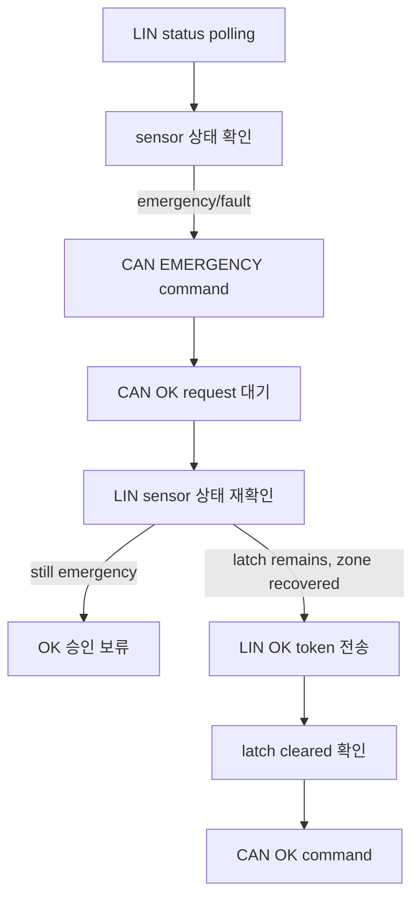

# LIN/CAN 조정 노드

`S32K_LinCanBle_master`는 LIN 센서 노드와 CAN 응답 노드 사이에서 상태 확인과 명령 전달을 담당하는 조정 노드입니다. 이름에 `Ble`가 포함되어 있지만, 이 저장소는 BLE protocol stack을 직접 구현하지 않고 외부 모듈 또는 UART peer 명령을 보조 UART 경로로 연결합니다. Cooperative 버전은 `s32k_cooperative/S32K_LinCanBle_master/`에 있고, FreeRTOS 버전은 `s32k_rtos/RTOS_S32K_LinCanBle_master/`에 있습니다.

---

## 1. 역할

이 노드는 LIN master와 CAN command sender 역할을 함께 수행합니다. LIN으로 센서 상태를 확인하고, CAN으로 응답 노드에 emergency 또는 OK 명령을 전달합니다.

주요 책임은 다음과 같습니다.

- UART console 상태 출력 및 명령 입력 처리
- 외부 UART peer 또는 BLE 모듈 명령 브리지 처리
- LIN 센서 노드 status polling
- 센서 emergency/fault/stale 상태 판단
- CAN 응답 노드에 emergency 명령 전달
- CAN OK request 수신 후 LIN 센서 상태 재확인
- 조건 만족 시 LIN OK token 전송
- latch 해제 확인 후 CAN OK 명령 전달

---

## 2. 주요 흐름

OK request는 CAN 응답 노드의 로컬 버튼 입력에서 시작되지만, 최종 승인 권한은 조정 노드가 갖습니다. 조정 노드는 최신 LIN sensor 상태를 확인한 뒤에만 OK 명령을 전달합니다.

---

## 3. 실행 task

### Cooperative 버전

| task | 주기 | 역할 |
|---|---:|---|
| UART | 1 ms | console 입력/출력 처리 |
| LIN fast | 1 ms | LIN 상태기계 진행 |
| CAN | 10 ms | CAN 송수신 및 결과 처리 |
| LIN poll | 20 ms | sensor status polling |
| render | 100 ms | 상태 화면 갱신 |
| heartbeat | 1000 ms | 주기 상태 표시 |

### FreeRTOS 버전

| task | 주기 | 역할 |
|---|---:|---|
| UART task | 1 ms | console 입력/출력 처리 |
| CAN task | 10 ms | CAN 송수신 및 결과 처리 |
| LIN task | 1 ms / 20 ms | LIN fast 처리와 status polling 처리 |
| render task | 100 ms | 상태 화면 갱신 |
| heartbeat task | 1000 ms | 주기 상태 표시와 관찰 정보 갱신 |

---

## 4. 핵심 파일

| 파일 | 역할 |
|---|---|
| `app/app_master.c` | emergency 판단, OK relay, sensor/response node 사이 승인 정책 |
| `app/app_core.c` | app module 조립, task entry, CAN/LIN 결과 처리 |
| `app/app_console.c` | UART console 명령 파싱과 상태 출력 |
| `app/app_ble_bridge.c` | 외부 UART peer 또는 BLE 모듈에서 들어오는 명령을 console 명령 흐름으로 연결하는 보조 UART bridge |
| `services/lin_module.c` | LIN master/slave 공용 상태기계 |
| `services/can_service.c` | CAN request/response 추적, pending timeout, queue 처리 |
| `runtime/runtime.c` | cooperative task table 또는 FreeRTOS task 생성 |
| `runtime/runtime_io.c` | LIN PID, OK token, board binding 구성 |

---

## 5. 통신 설정 요약

### CAN

| 항목 | 값 |
|---|---:|
| master node id | `1` |
| CAN 응답 노드 id | `2` |
| broadcast node id | `255` |
| command standard id | `0x120` |
| response standard id | `0x121` |
| event standard id | `0x122` |
| text standard id | `0x123` |
| frame buffer size | `16 bytes` |

지원 command code는 `OPEN`, `CLOSE`, `OFF`, `TEST`, `OK`, `EMERGENCY`, `STATUS_REQ` 계열입니다.

### LIN

| 항목 | 값 |
|---|---:|
| status PID | `0x24` |
| OK PID | `0x25` |
| OK token | `0xA5` |
| status frame size | `8 bytes` |
| OK frame size | `1 byte` |

---

## 6. 구현 포인트

- CAN OK request를 즉시 승인하지 않고, LIN sensor 상태를 다시 확인한 뒤 복구 명령을 전달합니다.
- LIN status가 오래되거나 fault 상태이면 복구 승인을 보류합니다.
- LIN OK token 전송 후 latch 해제 상태를 확인하고 CAN OK 명령을 보냅니다.
- console 출력은 input/task/source/result/value 성격의 snapshot을 나누어 상태를 관찰하기 쉽게 구성했습니다.
- 보조 UART 경로는 외부 UART peer 또는 BLE 모듈에서 들어오는 명령을 console 명령과 같은 흐름으로 처리하기 위한 명령 브리지입니다.
