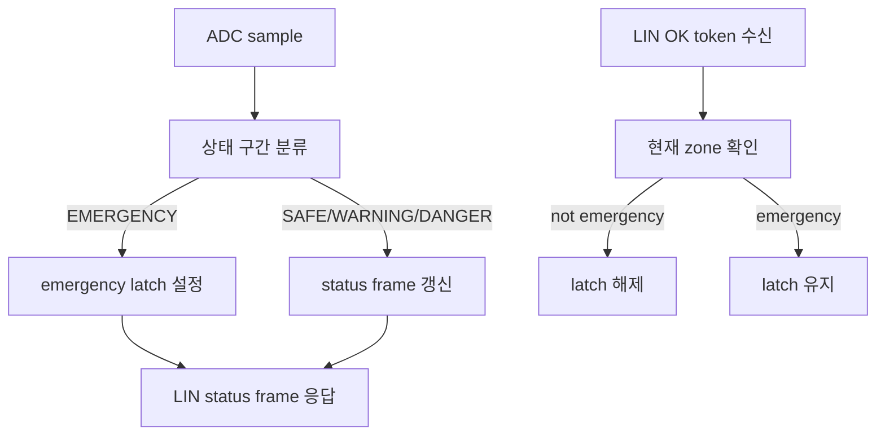

# LIN 센서 노드

`S32K_Lin_slave`는 ADC 값을 상태 구간으로 분류하고, 그 결과를 LIN status frame으로 제공하는 센서 노드입니다. Cooperative 버전은 `s32k_cooperative/S32K_Lin_slave/`에 있고, FreeRTOS 버전은 `s32k_rtos/RTOS_S32K_Lin_slave/`에 있습니다.

---

## 1. 역할

이 노드는 ADC 입력을 읽어 센서 상태를 만들고, 조정 노드의 LIN 요청에 응답합니다.

주요 책임은 다음과 같습니다.

- ADC sampling
- ADC 값을 `SAFE`, `WARNING`, `DANGER`, `EMERGENCY` 상태로 분류
- emergency latch 유지
- LIN status frame 응답
- LIN OK token 수신
- 현재 상태가 emergency가 아닐 때에만 latch 해제
- LED를 통한 센서 상태 표시

---

## 2. 상태 흐름

latch는 OK token만으로 무조건 해제되지 않습니다. 센서의 현재 상태가 emergency가 아닐 때에만 latch를 해제합니다.

---

## 3. 실행 task

### Cooperative 버전

| task | 주기 | 역할 |
|---|---:|---|
| LIN fast | 1 ms | LIN 상태기계 진행 |
| ADC | 20 ms | ADC sampling 및 상태 분류 |
| LED | 100 ms | 센서 상태 표시 |
| heartbeat | 1000 ms | 주기 상태 표시 |

### FreeRTOS 버전

| task | 주기 | 역할 |
|---|---:|---|
| LIN fast task | 1 ms | LIN 상태기계 진행 |
| ADC task | 20 ms | ADC sampling 및 상태 분류 |
| LED task | 100 ms | 센서 상태 표시 |
| heartbeat task | 1000 ms | 주기 상태 표시 |

---

## 4. 핵심 파일

| 파일 | 역할 |
|---|---|
| `app/app_slave2.c` | 센서 노드 정책, ADC 상태 처리, latch clear 조건 처리 |
| `app/app_core.c` | app module 조립과 task entry |
| `services/adc_module.c` | ADC raw value sampling, 상태 구간 분류, latch 상태 관리 |
| `services/lin_module.c` | LIN slave 상태기계, status frame 응답, OK token 처리 |
| `drivers/adc_hw.c` | ADC driver adapter |
| `drivers/led_module.c` | LED pattern 제어 |
| `runtime/runtime.c` | cooperative task table 또는 FreeRTOS task 생성 |
| `runtime/runtime_io.c` | LIN PID, ADC, LED, board binding 구성 |

---

## 5. LIN status / OK token

| 항목 | 값 |
|---|---:|
| status PID | `0x24` |
| OK PID | `0x25` |
| OK token | `0xA5` |
| status frame size | `8 bytes` |
| OK frame size | `1 byte` |

status frame에는 sensor zone, latch 상태, fault 상태, ADC raw value가 포함됩니다. 조정 노드는 이 정보를 기준으로 CAN 응답 노드에 보낼 명령을 결정합니다.

---

## 6. 하드웨어 요약

| 기능 | 핀 / 주변장치 | 설명 |
|---|---|---|
| ADC input | PTC14 / ADC0_SE12 | 상태 분류에 사용하는 analog input |
| LIN RX/TX | PTD6 / PTD7, LPUART2 | LIN slave 통신 경로 |
| LIN enable | PTE9 GPIO | LIN transceiver enable |
| Red LED | PTD15 / FTM0_CH0 | board profile 기준 active-low LED |
| Green LED | PTD16 / FTM0_CH1 | board profile 기준 active-low LED |

---

## 7. 구현 포인트

- ADC 값을 상태 구간으로 변환하는 센서 추상화를 둡니다.
- emergency 상태가 한 번 감지되면 latch를 유지합니다.
- latch 해제는 LIN OK token과 현재 센서 상태 조건을 모두 만족해야 합니다.
- LED는 센서 상태와 latch 상태를 보드에서 바로 확인하기 위한 표시 출력입니다. 실제 actuator 제어 출력은 포함하지 않습니다.
